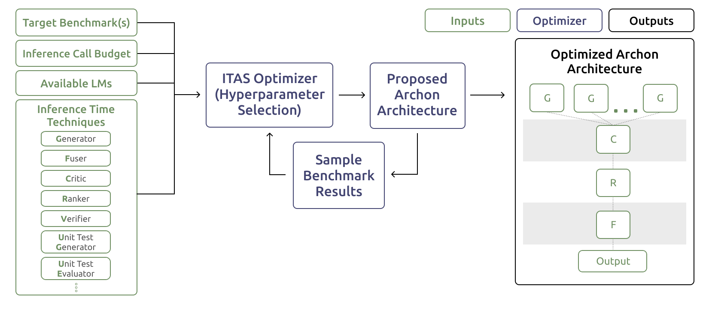

# Archon: An Architecture Search Framework for Inference-Time Techniques

This repository provides the accompanying code for [Archon: An Architecture Search Framework for Inference-Time Techniques](https://arxiv.org/abs/2409.15254)

Inference-time techniques allow us to bolster the strengths of existing LMs by utilizing multiple sample calls and multiple LMs to increase system performance for a given task.
Archon provides a modular framework for combining different inference-time techniques and LMs with just a JSON config file. Check out our [Quick Start](#quick-start) guide to get started.


## Table of Contents
- [Installation](#installation)
    - [Python Package](#python-package)
    - [Running Locally](#running-locally)
- [Archon Overview](#archon-overview)
- [Quick Start](#quick-start)
- [Tutorials/Examples](#tutorialsexamples)
- [gen_answers.py and Benchmarks](#gen_answerspy-and-benchmarks)
    - [Add Your Own Benchmark](#add-your-own-benchmark)
- [Key Handling](#key-handling)

## Installation 

### Python Package
Archon is publicly available for use at [here](https://pypi.org/project/archon-ai/).
```
pip install archon-ai
```
A tutorial on how to use it can be found [here](https://colab.research.google.com/drive/1Hw8zNrTJdJ5bIJPtEljQ-UxC3n6udp2_?usp=sharing)
### Running Locally

Alternatively, you can use Archon directly from this repository. This is the most up to date and offers the most flexibility working with our codebase

```shell
git clone https://github.com/ScalingIntelligence/Archon.git
git submodule init
git submodule update
```
  
We recommend using our environment that can be initialized with:
```
conda env create -f archon_env.yml
conda activate archon_env
pip install -r requirements.txt
````

We recommend you work within the `archon/` directory.
Archon can be instantiated via the [Archon](https://github.com/ScalingIntelligence/Archon/blob/main/archon/archon.py#L176) class in `archon.py`. Get started by cloning the repository and navigating to our [quickstart.py](src/quickstart.py) or creating your own starter file that imports our Archon class as shown below: 
```python
from archon.completions import Archon
```
## Archon Overview
Our Archon codebase provides users with the ability to run Archon configurations. We highly recommend reading our research paper [here](https://arxiv.org/abs/2409.15254).

At the moment, we provide support for these inference times techniques: `generator`, `fuser`, `critic`, `ranker`, `verifier`, `unit_test_generator`, `unit_test_evaluator`. Their prompts can be found [here](src/archon/completions/components/prompts.py). As well as the ability to [add your own components](#tutorialsexamples). 

We also provide these API Access points that can be used in Archon configurations: `Together_API`, `OpenAI_API`, `Anthropic_API`, `Groq_API`, `Google_API`, `tgi`, `Bedrock_API`. You can also [add your own generators/endpoints](#tutorialsexamples).

## Quick Start
This colab notebook is a tutorial on how to use the Archon python package.

<a target="_blank" href="https://colab.research.google.com/drive/1Hw8zNrTJdJ5bIJPtEljQ-UxC3n6udp2_?usp=sharing">
  
</a>
 <br> <br>

Archon works by taking in a config file in JSON format that specifies the architecture you want to run and its available parameters. 
Say I want to ask a compound GPT 4o system a question and output a singular response. We want to sample gpt-4o 10 times, rank the top 5 responses, and then fuse for a final response. We can create a config that looks like this:
```
archon_gpt_config = {
    "name": "archon-gpt-multi-model",
    "layers": [
        [
            {
                "type": "generator",
                "model": "gpt-4o",
                "model_type": "OpenAI_API",
                "top_k": 1,
                "temperature": 0.7,
                "max_tokens": 2048,
                "samples": 10
            }
        ],
        [
            {
                "type": "ranker",
                "model": "gpt-4o",
                "model_type": "OpenAI_API",
                "top_k": 5,
                "temperature": 0.7,
                "max_tokens": 2048,
            }
        ],
        [
            {
                "type": "fuser",
                "model": "gpt-4o",
                "model_type": "OpenAI_API",
                "temperature": 0.7,
                "max_tokens": 2048,
                "samples": 1
            }
        ]
    ]
}
```
To generate a response:
```python
# archon_config can also be stored and read from a file. Then passed to Archon()
archon = Archon(archon_gpt_config)

testing_instruction = [{"role": "user", "content": "How do I make a cake?"}]

response = archon.generate(testing_instruction)

print(response)
```
A full local example can be seen in our [quickstart.py](src/quickstart.py) file or [quickstart colab notebook](https://colab.research.google.com/drive/1DH-vsm6aLxoaIPqs9xFYOBj_n6NFKEPm?usp=sharing).

## Tutorials/Examples 
To fully take advantage of what Archon has to offer, we recommend you take a look at our tutorials/examples.

|  **Tutorial** | **Link** | **Description** |
| ------------- |  -------------  |  -------------  | 
| [**Archon Research Paper (Link)**](https://arxiv.org/abs/2409.15254) | [Open Link](https://arxiv.org/abs/2409.15254)  | The research paper for "Archon: An Architecture Search Framework for Inference-Time Techniques". We recommend you start here to understand what Archon is, how our components work, how Archon works as a framework, how Inference-Time Architecture Search (ITAS) leverages Archon to maximize generation quality for a wide range of tasks, and more. |
|   [**Archon Tutorial (Colab)**](https://colab.research.google.com/drive/1Hw8zNrTJdJ5bIJPtEljQ-UxC3n6udp2_?usp=sharing) | [](https://colab.research.google.com/drive/1Hw8zNrTJdJ5bIJPtEljQ-UxC3n6udp2_?usp=sharing) | A more in-depth tutorial on Archon. It goes into the set-up, its components, and examples across different tasks. Highly recommend starting here.|
| [**Quick Start (File)**](src/quickstart.py) | [](https://colab.research.google.com/drive/1DH-vsm6aLxoaIPqs9xFYOBj_n6NFKEPm?usp=sharing)  |  Introduces Archon and how to create and use a compound Archon configuration of gpt-4o models. |
|   [**Single Model Query (Config)**](src/archon/configs/individual_models/gpt-4o-2024-05-13.json) | [](https://colab.research.google.com/drive/1Y9qg4DDQs8RK-VXSEj9jZaK-fAUfTbFM?usp=sharing) | A single gpt-4o model call. |
|   [**Custom Components (Colab)**](https://colab.research.google.com/drive/11h-uL2D7oFiSu6HdQIHlf_xDyRDOy56m?usp=sharing) | [](https://colab.research.google.com/drive/11h-uL2D7oFiSu6HdQIHlf_xDyRDOy56m?usp=sharing) | We offer support on adding your own components apart from the supported ones (generation, fusion, ranking, etc). The colab notebook will show you how to create a component, add it to your configs, and add it to Archon with add_component. Furthermore, you can pass a custom state between components, allowing you to have multiple custom components that can send information between eachother.|
|   [**Custom Generator/Endpoint (Colab)**](https://colab.research.google.com/drive/1D1Mecl1jJNRY875ThLGJZupRRQC53lk3?usp=sharing) | [](https://colab.research.google.com/drive/1D1Mecl1jJNRY875ThLGJZupRRQC53lk3?usp=sharing) | We offer support to add your own generator if you need a custom access point or need more than the ones provided (Together, OpenAI, etc). The colab notebook will show you how to add a custom endpoint. Here you will see how to create a generator function, add it to your configs, and add it to Archon with add_generator.|
|   [**Improving GPT 4o using Archon (Config)**](src/archon/configs/archon-gpt-4o-sample_10_then_rank_top_5_then_critic_then_fuse.json) | [Open Config](src/archon/configs/archon-gpt-4o-sample_10_then_rank_top_5_then_critic_then_fuse.json) | An Archon configuration which uses multiple gpt-4o calls to produce higher quality result compared to a single call of gpt-4o|
| [**Open-sourced Archon to outperform GPT 4o (Config)**](src/archon/configs/archon-70Bx8_1_samples_then_critic_then_fuser_with_Qwen2_72B.json) | [Open Config](src/archon/configs/archon-70Bx8_1_samples_then_critic_then_fuser_with_Qwen2_72B.json) | An Archon configuration which uses only open sourced LLMs that would produce higher quality results compared to a single call of gpt-4o|
|[**Advanced Multi-Model Setup (Colab)**](https://colab.research.google.com/drive/1LBFIi_IRXvQ6m_z0Fjjer8XdyZPdUN0b?usp=sharing) | [](https://colab.research.google.com/drive/1LBFIi_IRXvQ6m_z0Fjjer8XdyZPdUN0b?usp=sharing) | Archon config that showcases multiple layers of generations, critics, ranking, and fusing.|


## gen_answers.py and Benchmarks

We provide the script [gen_answers.py](src/archon/completions/gen_answers.py) so users can generate answers for supported benchmarks. We recommend you open and understand the file and its arguments.

We provide seperate READMEs for their respective usage and evaluation as seen with [MT Bench](src/archon/benchmarks/mt_bench/README.md), [Arena-Hard-Auto](src/archon/benchmarks/arena_hard_auto/README.md), [AlpacaEval](src/archon/benchmarks/alpaca_eval/README.md), [MixEval](src/archon/benchmarks/mix_eval/README.md), [MATH](src/archon/benchmarks/math/README.md), [CodeContests](src/archon/benchmarks/code_contests/README.md), [GSM8K](src/archon/benchmarks/gsm8k/README.md), and more. A complete list and their implmentation can be found at [benchmarks.py](src/archon/benchmarks/benchmarks.py).

Here is an example on how to use gen_answers.py for running your config against ArenaHardAuto. <br> 
We recommend you run all files as python modules with the -m flag and out of the src/ directory:
```python
# run gen_answers out of src/ directory
python3 -m archon.completions.gen_answers --benchmark arena_hard_auto --config <your-config-file>.json  --parallel 32
```
This will run the model structure specified in your config file against the question set specified under the ArenaHardAuto class and output the responses in `.jsonl` format to the `src/outputs/arena_hard_auto/model_answer/` folder.

#### Add Your Own Benchmark
To add your benchmark, you must edit the benchmarks.py file and add your benchmark class. The 'Benchmark' class can be used as a base class for interfacing between gen_answers.py and your benchmark. Lastly, make sure to add your evaluation to 'BENCHMARK_CLASSES' so it can be used as an argument in gen_answers.py

## Key Handling
Archon supports a couple different ways of setting your API Keys:

#### 1. Set api keys in a .env file (Recommended)
Archon uses [python-dotenv](https://pypi.org/project/python-dotenv/) to load environment variables from a `.env` file. Create a `.env` file at the root of your repo with your api keys. 
```
export ANTHROPIC_API_KEY=<your_api_key>
export OPENAI_API_KEY=<your_api_key>
export TOGETHER_API_KEY=<your_api_key>
export TOGETHER_API_KEY_2=<your_api_key>
export TOGETHER_API_KEY_3=<your_api_key>
```
The numbers at the end of the api keys are an example of how setup a `.env` file to take advantage of Archon's [key swapping](#key-swapping) feature.

#### 2. Set api keys using an api_keys.json file
You can pass a JSON file path or a dictionary that holds your keys. An example of the expected file/dictionary format is seen in [api_keys.json](api_keys.json). For example. you would initialize Archon with:
```python
archon = Archon(config, "path_to_keys/file.json")
```
*Warning: FastChat will not work with just this approach and would require having api keys set as an environment variable. There may be other benchmarks that function this way which is why option 1 is preferred.* 

#### 3. Set api keys using a dictionary that holds your keys
Instead of passing in a path to a JSON file, you can directly pass in a dictionary object with the same structure as the provided example [api_keys.json](api_keys.json).
```python
keys_dict = {...}
archon = Archon(config, keys_dict)
```
### Key Swapping
Archon has a built-in system that swaps through your keys if you hit a rate limit. We found this helpful when making an extensive number of inference calls. The `_<number>` suffix for the API keys specified in your `.env` file denote the order the keys are tried. Essentially, Archon will use the first key (with no number at the end) until a rate limit is hit and then switch to `API_KEY_2` if it's available. This process repeats as Archon cycles through your available keys. The process works similarly for the dictionary/JSON approach using the keys stored in each key-list pair.

## Citation
```bibtex
@misc{saadfalcon2024archonarchitecturesearchframework,
      title={Archon: An Architecture Search Framework for Inference-Time Techniques}, 
      author={Jon Saad-Falcon and Adrian Gamarra Lafuente and Shlok Natarajan and Nahum Maru and Hristo Todorov and Etash Guha and E. Kelly Buchanan and Mayee Chen and Neel Guha and Christopher Ré and Azalia Mirhoseini},
      year={2024},
      eprint={2409.15254},
      archivePrefix={arXiv},
      primaryClass={cs.LG},
      url={https://arxiv.org/abs/2409.15254}, 
}
```
